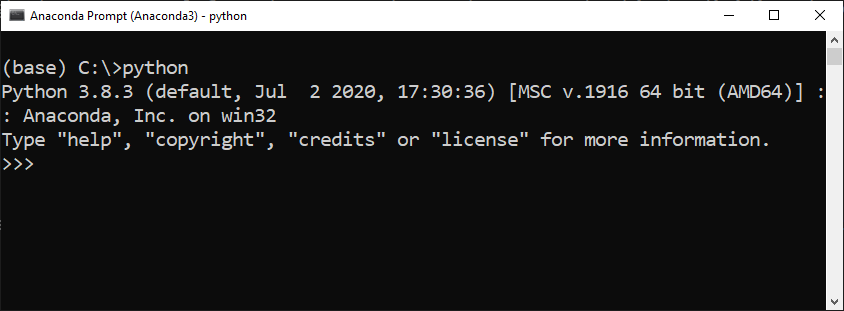

# Ready to go
Now that we have an installed Python environment we are ready to go. You can only learn programming by doing. Programming is like learning to ride a bike. You can read many books about bikes and about riding a bike, but you will only know what it is really like to ride a bike if you try it out for yourself.

This means your starting point is reading the chapters carefully but you *must* also become active and try things out and explore for yourself. This exploration is an active process where you create a mental model of how things work. This mental model must be tested, extended, falsified and corrected. This might take some time and it is exhausting but it is worth the effort and you will unterstand things better.

We will start this chapter by using and exploring an interactive Python session as a calculator.

# Python as a calculator
For our first exploration we will use a Python REPL. REPL stands for: `Read - Evaluate - Print - Loop` (you don't need to remember this). Starting Python in an interactive REPL mode helps us exploring things and sharpening our mental model.

Let's start a Python REPL. You can do this python calling `python` in the anaconda prompt:
``` python
$ python3
```
You will see a Python prompt like this:


We have started a python session and can start "talking python" now. In some cases this is very similar to certain aspects (@abi: I need a better word than aspects) you already know, like using a calculator. Let's solve a problem by using the python prompt as a calculator.

How much money a year do we make if we get a monthly salary of $3250 and bonus of $4500 once a year. Try to solve it for yourself, now.
``` python
>>> 3250 * 12 + 4500
43500
``` 
As you see Python behaves like a normal calculator and prints the result of our expression immediatly. Let's continue with another example.

Lets try to calculate how long it takes for light beam to travel from the sun to the earth. We can do this by dividing the distance between the sun and the earth by the speed of light **c**.
Mean distance between sun and earth: 149600000 km
Speed of light: 300000 km per second

``` python
>>> 149600000 // 300000 
498
``` 

The two backslashes between our numbers is called an `operator`. In the example above we used a so called `truncating division` by using `//`. This will deliver us an integer value and the result is always rounded down. Compare what changes if you use a "normal division" by using the `/` operator 

``` python
>>> 149600000 / 300000 
498.6666666666667
``` 

By using a `/` we get a floating point value as a result. The result we get is in seconds. If we want our result in minutes we must divide our last result by 60.

In an interactive session the last result of a calculation is stored automatically. We can access it by using `_`. Pay attention: This does only apply to interactive sessions!

``` python
>>> 149600000 / 300000 
498.6666666666667
>>> _ / 60
8.311111111111112
``` 

So a light beam takes a little bit more than 8 minutes from the sun to the earth. That was easy :)

# Literals
So far we have explored two data types in Python: an integer representing a whole number and floating point numbers. A direct denotation of data values in programs is known as a **literal**, or more verbose an **integer literal** or rather **floating point literal**. 

# Different number representations
If you read the examples from above it might be hard to figure out the exact numbers without counting decimal places. Is the distance to the sun 1.4 million kilometers, 14.9 million kilometers or 149.6 million kilometers?! That's not easy to tell without counting digits.

Python delivers us a possibility to make it easier for humans to read these numbers by using a `_` as a delimiter:

``` python
>>> 149_600_000 // 300_000 
498
``` 

Even though you can technically use the `_` delimiter in every position it is highly encouraged to only use it as a thousands separator.

You can also create integer values by using a scientific representation using `E` or also a lower case `e`. Let's calculate the the travel of a light beam using meters instead of kilometers:
``` python
>>> 149_600_000 * 1E3 // 3E8
498
``` 

# Operators in Python
So far we have used the truncating division operator `//` and division operator `/`. Python understands a lot more operators. Some operators are used on a regular basis, some are used rather rarely.
```
+ - * / % ** // << >> &
| ^ ~ < <= > >= <> != ==
```

Exercise: 
1) Can you figur out what the `%` and `**` operators do?
2) Play around with some mathematical operators. Can you calculate how many days you are alive? Can you represent the result in days, hours and also in minutes?

# Giving things a name
So far we have used literals and operators. Let's give these numbers a meaningfull name. We can do this by using identifiers, also known as variables.

``` python
>>> mean_distance = 149_600_000 
>>> speed_of_light = 300_000 
>>> mean_distance // speed_of_light
498
```

As you see in the example instead of using the integer literals directly we give them meaningfull names. We can use these names whenever we need the actual value. This makes our programs easier to read for us and other people. Everyone will know directly, what we want to express with these numbers.

## Naming conventions
By convention we write identifiers for literals in lower case. Even though the interpreter would accept a identifier like `Age = 17` it is no good style and we should avoid it.

It is not possible for use to use spaces in identifiers. So the following code will result in an error:

``` python
>>> mean distance = 149_600_000 
File "<stdin>", line 1
    mean distance = 149_600_000
         ^
SyntaxError: invalid syntax
```

Whenever we want to use a space as a word separator we use an underscore instead. This is also known as `snake_case` (compared to other case styles like `camelCase` or `kebab-case`)

Make sure that every identifier used so far is:
- starts with a lower case character
- uses `_` instead of spaces

The formal rules for identifiers in Python are as followed:
- Start with a character or underscore
- Cannot start with a number
- May contain a number after a character or underscore
- Cannont contain other characters than upper and lowercase characters, numbers and underscores


Differ between formal and informal rules.
Formal rules are enforced by the interpreter, informal rules must be enforced by us

# Binding
Giving things a name. Bind a name to an existing object


# statements, expressions


# immutable/mutable

# further readings: pep8
# chapter reference


