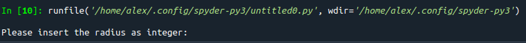
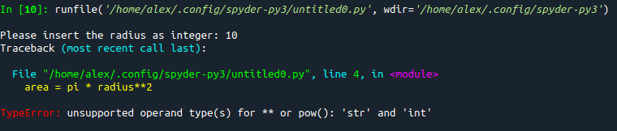

# Executing a Python file
In the previous chapter we used an interactive Python Prompt to solve some problems like the yearly salary calculator or the travel time of a light ray between the sun and the earth.

We will now use a Python file instead of an interactive session.
Open up `spyder`, create a new file and insert the following code:
``` python
radius = 2
pi = 3.1415
area = pi * radius**2
```

Execute this code by pressing the `Run file` button (`F5`).

As an output you will see ... nothing!

Why is this so? By using a REPL (read, evaluate, PRINT, loop), every expression will automatically be printed. If we run Python code in an editor the interpreter will evaluate the file line by line. And nothing will be automatically printed, because executing a Python file is not the same as using a REPL.

To print the result we will use a function which Python delivers for us which will do the job. This function is called (suprise!) `print`.

We change our file and use `print`:
``` python
radius = 2
pi = 3.1415
area = pi * radius**2
print(area)
```
You should now see the output `12.566`. 

## Adding comments to the file
Let's extend our program by the following line:
``` python
# This program will calculate the area of a circle
radius = 2
pi = 3.1415
area = pi * radius**2
print(area)
```
The first line is called a source code comment, or just comment. In Python, every comment starts with an `#`. This line will not be interpreted, it is just like a note we leave for somebody (e.g. our future self, or a fellow programming buddy).

So by using a comment, we describe in this case what our program acutally does.

Important: A comment does nothing. So if we put a comment before every line, our programm does nothing.

``` python
# This program will calculate the area of a circle
# But does actually nothing, because every line is commented
# radius = 2
# pi = 3.1415
# area = pi * radius**2
# print(area)
```

# Using text
If we save our file and someone else will execute it without looking at the content he or she may not understand what our program actually does. Just the number `12.566` is not enough. There is some context missing. So it would be nice if we could create some text and also print this text.

We call a text-based information a `string`. We can create strings in Python by using single or double quotes:
``` python
# This program will create and print some strings
greeting = "Hello!" # this statement is a string created with double quotes
print(greeting)     # this statement prints the content of greeting

# create a string using single quotes
sentence = 'Python is fun and easy to learn'

print("You are doing great!", sentence) # prints multiple strings
```

So let's use a string to extend our previous example with some additional textual information like `"The area of a circle with radius 2 is 12.566"`.

Can you do this on your own? Try it out for yourself. If you are done or get stuck, read ahead.

``` python
# This program will calculate the area of a circle
radius = 2
pi = 3.1415
area = pi * radius**2
print("The area of a circle with radius", radius, "is", area)
```
Python will automatically add a space between multiple printed values 

# User input
If we want to calculate the area of a circle with a different radius we need to change our program. We must change the second line:
``` python
# This program will calculate the area of a circle with radius 14
radius = 14
pi = 3.1415
area = pi * radius**2
print("The area of a circle with radius", radius, "is", area)
```
There must be a better way than changing our program manually!

What about asking the user for input? We can acutally do this.
``` python
# This program will calculate the area of a circle
# The user is asked for the radius
radius = input("Please insert the radius as integer: ")
pi = 3.1415
area = pi * radius**2
print("The area of a circle with radius", radius, "is", area)
```

We can use the builtin function `input` in Python to request user input.

Let's change our program like in the example above and try to execute it. We will be asked for a radius, which is nice:


But if we enter a number (e.g. 10) and hit enter, we get an error message.


So why do we get an error message? What is the problem? Read the error message and think about it ...

We see that the error occurs in line 4. And Python does also tell us that it cannot use the operator `**` for a str and an int. So either `radius` or the `2` must be a string. We can exclude the `2` which is definitiv an integer number, so it must be radius!

And indeed, `input()` does deliver us the user input as a string and we bind the name `radius` to the user input of `10` as a string. To be able to use the string `"10"` in calculations we must convert it to a number.

Python does also deliver us the needed functionality. We can use the builtin function `int` for that. 

``` python
# This program will calculate the area of a circle
# The user is asked for the radius
radius = int(input("Please insert the radius as integer: "))
pi = 3.1415
area = pi * radius**2
print("The area of a circle with radius", radius, "is", area)
```

Take a close look at line 3. Instead of binding the result of `input` directly to the name `radius` we first convert the result to an integer by using `int()` and bind the result of `int` to the name `radius`. These are 3 steps in one line (requesting input, converting input and binding the converted input to the name radius).

Instead of doing everything in one line, it may be clearer if we divide these 3 steps:
``` python
# This program will calculate the area of a circle
# The user is asked for the radius
user_input = input("Please insert the radius as integer: ")

# interpret the user input as an integer and bind to name radius
radius = int(user_input)
pi = 3.1415
area = pi * radius**2
print("The area of a circle with radius", radius, "is", area)
```


someone will execute our 
strings
print

# Control flow

# `if` and `else`

### `True` and `False` 

# loops
for loop 

while loop


# user input

# Exercises
[Exercises for week 3](../../exercises/week3/week3.md)

[Overview](../overview.md) \| [Previous chapter](../03_loops/loops.md)| [Next chapter](../04_loops/functions.md)


# Bad jokes

- What are the 3 hardest parts of programming? Giving things proper names and off by one errors

- If the programmer gets really frustrating while debugging, they may reach their break point

- Why did the 0 break up with the 1? Because it was a bit too much

- I like UDP jokes, but I never know if anyone gets them

- !False is funny because it's True

- Relationships are like databases; don't commit until you are certain

- How many software Engineers does it need to change a bulb?

Zero, it's a hardware problem

*Adds a sticknote: //TODO: Fix this, worked yesterday*

- I have a programming joke but it only works on my computer

- An SQL statement comes into a bar ans sees two tables and he says: "Can I join you?"

- Why did the programmer get glasses? He could'nt C#

- Why did the developer move to Mexico? Because he wanted to become a senor developer

- What's the best programmer vaccine? Json&Json

- Why do developers often confuse Halloween and Christmas? Because OCT 31 = DEC 25

- A programmer's wife has delivered a baby.
The doctor immediatly hands the newborn to the dad. The wife asks "is it a boy or a girl?"
The programmer says "yes"

- There are 10 types of people in this world. Those who understand binary and those who don't

- What's a pirates favourite programming language? You think it be the R, but it be the C

- Why Python lives on land? Because it is above C level

- I Would have made a joke about loops, but it's too repetitive

- What did false say to true? Stop boolean me
