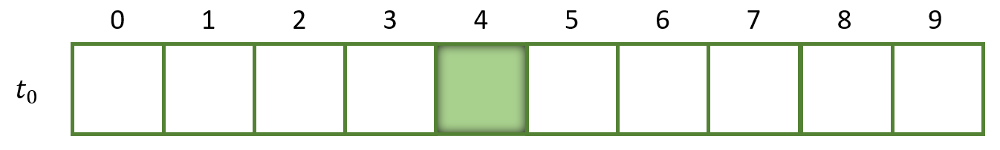
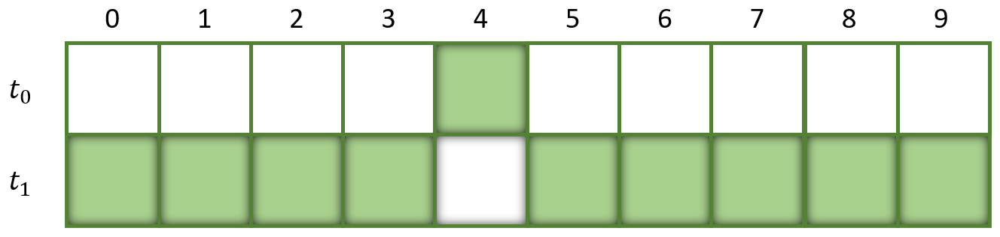
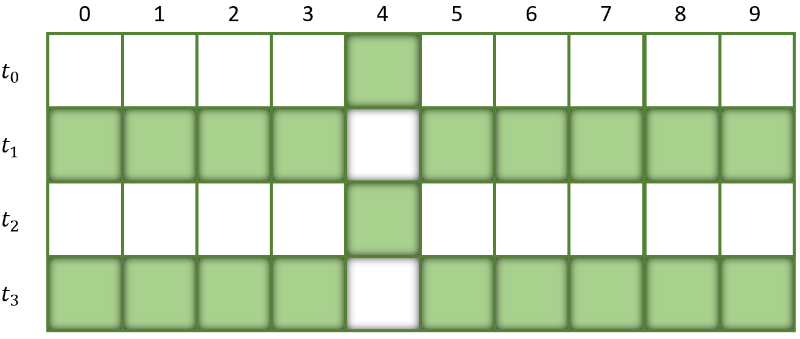
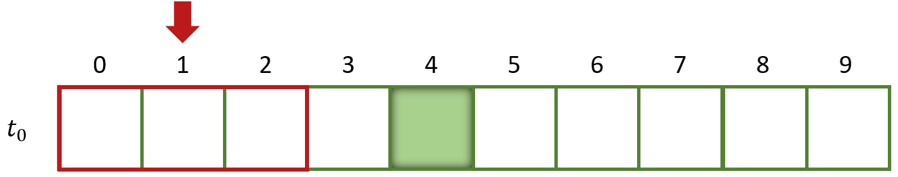
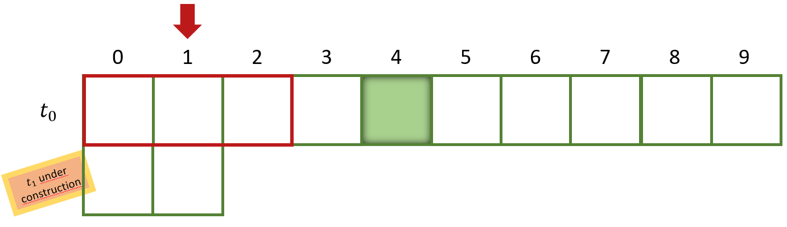
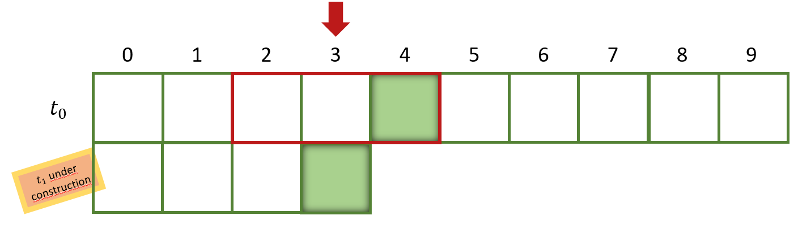
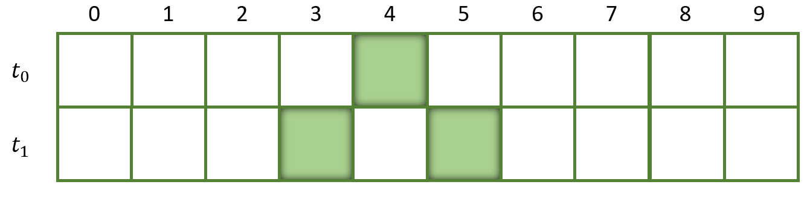
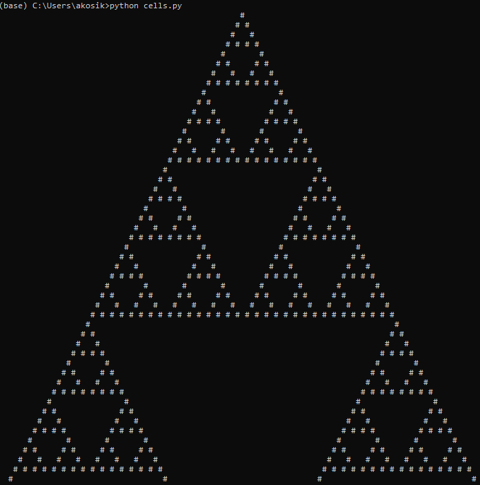

# Cellular automaton
In this chapter we will create a game without players. We will create **cellular automatons**.

A cellular automaton is a simplified world consisting of identical cells which have two states: dead or alive.

Instead of players interacting with our cells we will apply simple rules to each cell. Depending on the number of alive neighbours of the current cell and the applied rules the cell state will change (e.g. from living to dead or vice versa). 

So for these kind of games we need these things:

    - a game board
    - cells with two states (alive and dead)
    - game rules applied to the cells of our board

In the simplest case the board is 1-dimensional. The following picture shows a 1-dimensional board of length 10 with 1 living cell:


This is our current *population*. 

At time point `t_0` every cell is dead except the fifth cell (`idx 4`)

Let's now apply some simple rules. Let's say the next population emerges from the current population, but every cell which is dead in the current population will become alive in the next population and every cell alive in the current population will be dead in the next.

This simple rule is expressed in the following table:

| Current state | Next state |
|---------------|------------|
|    DEAD       |  ALIVE     | 
|    ALIVE      |  DEAD      | 

Applying this rule will result in the following population:


If we apply the rules multiple times the cell states will toggle back and furth. 



This toggling of cell states is kind of boring. Let's change this by applying more interesting rules. 

## Rule 90
In our previous example the state of the next cell only depends on the state of the current cell. The state of adjacent cells was not relevant.

Let's change this by inspecting not only the state of the current cell, but also the state of the direct adjacent neighbours. 

A dead cell is represented by a 0, a living cell is represented by an 1.
So if we inspect 3 cells at once we get 8 combinations of living and dead cells (`2**3`).
We will now apply the following rules:

| Current state | Next state |
|---------------|------------|
| 111           |  0         | 
| 110           |  1         | 
| 101           |  0         | 
| 100           |  1         | 
| 011           |  1         | 
| 010           |  0         | 
| 001           |  1         | 
| 000           |  0         | 

We will skip the cell with index 0 on the left edge of our 1-dimensional board because it has no left neighbour. Instead we start with index 1. The red box emphasizes the 3 cells we are currently looking at.



The next population is currently under construction. For the left outer cell we will use a dead cell and so we add a dead cell for index 0 in `t_1`.

Let's now have a look at the 3 cells with index 0-2. Our 3-cell-state for cell with index 1 is `000`. We look the current state pattern up in our Rule 90 table and see in the last row that `000` will map to `0` as the next cell state and so we add a dead cell again.

Our intermediate result looks like this:


If we proceed with index 2 we also have only dead cells in the direct neighbourhood (pattern `000`), so cell with index 2 of the next population is also dead.

It gets more interessting if we proceed with cell with index 3. Here we have the pattern `001` which will lead to a living cell. 


Try to figure out which pattern the cells with index 4 and index 5 have and which result will occure out of that.

Write your result down ... we will wait for you :)

Now you should be finished with your lookup. You have correctly identified that the cell with index 4 has the pattern `010`. For this pattern the Rule 90 table results in a dead cell. Cell with index 5 has a pattern of `100` and this will result in a living cell. For the rest we only have zeros and therefore dead cells. So if we apply Rule90 to every cell we get the following result of the next population:



To get our next population `t_2` we continue this procedure but use the population of `t_1` as a basis. As before we apply the rules and create our new population `t_2`. 

# Implementation in Python
The procedure of creating new populations out of existing populations is clear now. How can we implement this in Python?

We use a *top-down approach* for this by dividing the problem of cellular automaton into several smaller subproblems. These subproblems are:

    - Defining a cell with state DEAD and ALIVE
    - Finding an appropriate data structure to represent our 1-dimensional game board with our cells
    - Defining the rules
    - Finding an appropriate representation for our output
    - Implementing the control flow

Let's start with the cell itself.

## Cells
A cell has only two states: DEAD or ALIVE. So as in the rules above it may be obvious to use a `0` for a dead cell and an `1` for a living cell.

If we change the cell state from dead to alive we change the value from `0` to `1` and vice versa.

## Data structure for a 1-dimensional game board
For a 1-dimensional game board a Python `array` may be a good data structure. 

An array is very similar to a list. The behaviour is nearly identical, but we have to specifiy the type of object we can store in an array.

Remember: we can store different types of objects like `ints`, `floats`, `functions` or `strings` in lists. But in our case we only want to store single characters: in particular string `'1'` for a living cell, and string `'0'` for a dead cell. 

Using an array not only saves us memory, but also avoiding adding non compliant types by accident.

``` python
# to use arrays we have to import the array module
import array

# specify the board width
board_width=20

# creating the array 
# the 'u' specifies that we want to store (unicode) characters
# we initialize the array with only zeros (a string with in this case 20 zeros)
board = array.array('u', "0"*board_width)
``` 

## Defining the game rules
Let us now implement the game rules. Have a look at the table of Rule 90. What data structure comes to your mind if you look at the table? 

Scroll up and think about an appropriate data structure ...

The first thing that might come to your mind is using a dictionary as a lookup for the game rules. That's a great idea! :)

Using a dictionary for this is actually quite simple and expresses the intention of the game rules quit clearly. Look how similar the Python dictionary looks to our table.

``` python
rule_90 = {
    '111': '0', 
    '110': '1', 
    '101': '0', 
    '100': '1', 
    '011': '1', 
    '010': '0', 
    '001': '1', 
    '000': '0', 
}
```

## Representation
We start very simple and only print our results to the console. We do not use a graphical user interface (GUI) module for our output.

Why not using a GUI module? Let's keep things simple in the beginning. We can still expand our code later on ...

A simple approach it may be to print a string which represents our current population. An dead cell is represented by "nothing", so we just a space for a dead cell. A living cell is printed by a character which is mostly filled, e.g. '#' (a hashtag).

Let's have a look at how we may print our current population.
``` python
import array

# in this example we have a board of length 12
# the board is initialized with 0s and 1s
board = array.array('u', '001101011011')

# 'convert' the array to a string
current_population = "".join(board)
print(current_population)   # will output '001101011011'
```
Wait! This is not what we want. We want to have `spaces` instead of `0` and `#` instead of `1`. 

How can we do this? Think a moment about it ...

One way to do this is to replace every occurence in the string.
``` python
import array

# we have a board of length 12
# the board is initialized with 0s and 1s
board = array.array('u', '001101011011')

# create a string out of the array
current_population = "".join(board)

# replace with output format
current_population = current_population.replace('0', ' ')
current_population = current_population.replace('1', '#')
print(current_population)   # will output as expected :)
```
Remember: A string is immutable so we cannot change the string in place. Calling method `replace` will give us back a new string with each occurence replaced and we bind the name `current_population` to that new string.

An alternative to create our output string is to use the ternary operator in a generator expression in Python.
``` python
import array

# we have a board of length 12
board = array.array('u', '001101011011')

current_population = "".join( '#' if char == '1' else ' ' for char in board)
print(current_population)   # will output as expected :)
```

Which solution do you prefer? Which is easier to read and understand for you?

## Control flow
At this point we have more or less every subproblem solved. What's missing? We need to tie everything together and create a game loop.

```python
import time
import copy

# create a board with a length of 100
# initialize everything with zeros, except of the cell in the middle
population = ...

def new_population(current_population):
    """
    This method creates a new population out of the passed current_population
    """ 
    # copy the current_population for our new population
    new_population = copy.deepcopy(current_population)

    # let's iterate over the current_population (without the outer left and outer right edge)
    for index, _ in enumerate(current_population[1:-1], start=1):
        # use a slice to get adjacent cells
        start_index = index - 1
        end_index = index + 2 # Why do we use index + 2? Experiment with list slicing if you are unsure
        cell_slice = current_population[start_index:end_index]

        # convert the cell slive to a string. (We have already done, so scroll up if unsure)
        # Attention: Do not convert to the output format here!
        pattern = ...

        # look the pattern up in our rule. It is a normal dictionary lookup
        result = ...

        # set the result in the new_population
        new_population[index] = result

    # we are done. Let's return the new_population
    return new_population

while True:
    # convert the population to a string 
    # do the replacement of the output format here
    output_string = ...

    # print the current population
    print(output_string)

    # calculate new population
    population = new_population(population)

    # let's sleep a little bit. This will print 4 lines per second.
    # Adjust if desired
    time.sleep(0.25)
```

Is it not clear what the enumerate function does? Look it up: [enumerate in python](https://docs.python.org/3/library/functions.html#enumerate) 



Isn't it beautiful?!

You can break the current output by hitting `CTRL+C`

# Other rules
Rule 90 creates a wonderful image. It is also known as the `Sierpinski triangle`. 

But there are also other rules which create very interesting images. Adjust your program in a way so that the user can choose which rule should be applied. 

*Hint: use the Python function `input()` to ask the user for input.*
### Rule 30

| Current state | Next state |
|---------------|------------|
| 111           |  0         | 
| 110           |  0         | 
| 101           |  0         | 
| 100           |  1         | 
| 011           |  1         | 
| 010           |  1         | 
| 001           |  1         | 
| 000           |  0         | 

Rule 30 does magically appear also in nature. Have a look at this sea shell:


You can simulate this shell pattern with rule 30 for yourself. Try using a random string for your start configuration.

To create a random string of a defined length, use the following code:
``` python
import random

def random_sequence(length):
    return "".join(random.choice(['1', '0']) for _ in range(100))

start_seq = random_sequence(length=100)
print(start_seq) # prints random sequence of length 100
```


### Rule 110
| Current state | Next state |
|---------------|------------|
| 111           |  0         | 
| 110           |  1         | 
| 101           |  1         | 
| 100           |  0         | 
| 011           |  1         | 
| 010           |  1         | 
| 001           |  1         | 
| 000           |  0         | 


[Next (Game of Life)](./gol.md)
