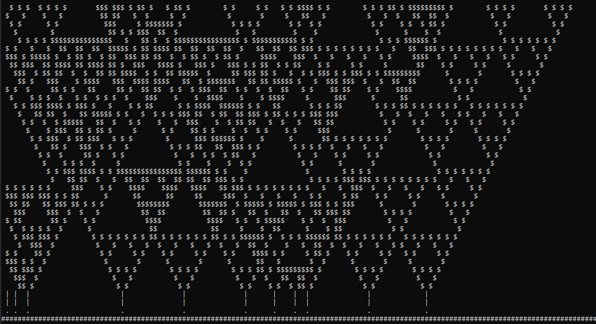

# Creating a forest

In the last chapter we used `rule 90` to create the Sierpinski triangle. We now want to use the the logic to create some trees/plants growing from the bottom to the top.

The final result should look similar to this:


The bottom line with the `#` symbols represent our foundation. On top of that we have some seeds (`.`) which are randomly distributed. Out of these seeds grow little stalks and out of that emerge our beautiful trees out of applying our well known `rule 90`.

Out of the fact that our plants grow step by step from bottom to top we cannot use a 1-dimensional game board, print the content of the board and forget about it. We could do that before, because a 1-dimensional board is actually just a row, printed from top to bottom one after another. 

For out forest we need a 2-dimensional board, drawn completly with every step and filled with content, step by step, from bottom to top. Because of the fact that we draw the complete board in every step and fill it from below it seems that our plants/trees are growing.

## 2-dimensional game board

We used a list of `1s` and `0s` for our 1-dimensional game board before. Let's call this a row. We can create a 2-dimensional board by defining an list of these rows. 

```python
# create a board with fixed width and height
width = 150
height = 40

# the width defines the length of our row
# we need this row `height` times. So let's create a loop
board = []
for _ in range(height):
    # create a list with width times `0`
    row = ['0' for _ in range(width)]

    # add this to our board
    board.append(row)

# our board now consists of 40 rows with length 150

```

We could also use a nested *list comprehension*  for this, that is an alternative solution for creating the board:
```python
width = 150
height = 40
board = [['0' for _ in range(width)] for _ in range(height)]
```

*Note: We could use numpy for a 2-dimensional board/2-dimensional array. But I intentionally used only Python builtins. Using frameworks like numpy or pandas kind of feels like learning a new programming language and this is not the intention of this course.*

## Using different symbols
In our previous example we always used the same kind of symbols (only `#` symbols). We want to change this for our forest. The foundation should be for example only consist of `#`, the stalks consist of `|` and the actual plant consists of `$`. 

**We do not want to change our logic in any way**. We want to *reuse* the `rule_90` and also the function `current_population`. Therefore we keep the logic as it is (with `0s` and `1s`) and 
