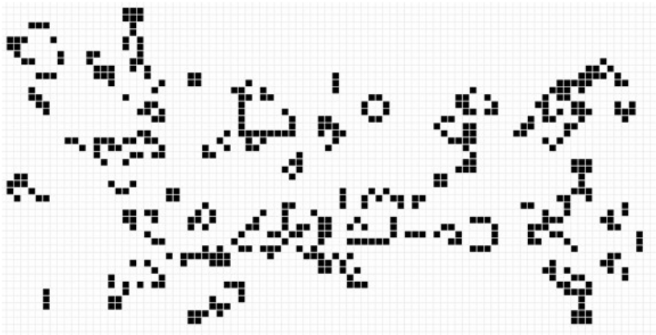
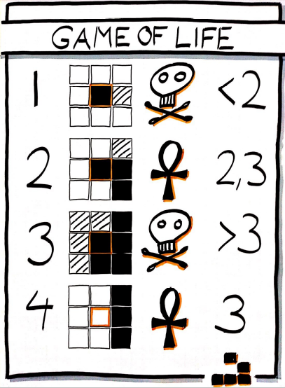
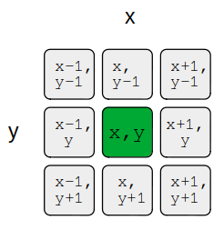
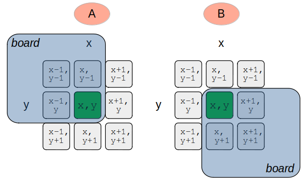

# Game of Life

The Game of Life is a 2-dimensional game without players. We have already created most of the components we need for the game in the previous chapter. 

For example:

- The 2-dimensional game board with cells
- The output of a 2-dimensional game board



The Game of Life consists of four simple rules, but their application makes our board come to life in incredible ways. Let's have a look how these rules are defined.

## Game rules
As before we calculate the next population using the current one. But the rules are a little bit different now. 

To calculate the next population we start with the number of alive neighbours of the current cell under inspection. Most cells (except the cells on the edge of the board) have exactly 8 neighbours. 



Let's have a look at the four rules in detail.

To be precise in what we mean let us call the cell with the orange boarder the "cell under inspection", or in a short way the `CUI`. 

### 1. Underpopulation
If the CUI has less than 2 living neighbours the cell is dead in the next population because of underpopulation.

### 2. Stay alive
If the CUI has exactly 2 or 3 living neighbours and it is alive it will stay alive in the next population. 

### 3. Overcrowding
If the CUI has more than 3 living neighbours it will be dead in the next population because of overcrowding

### 4. Resurrection
If a cell is dead in the current population but has exactly 3 living neighbours it will be resurrected and be alive in the next population.

How can we implement the game rules in Python? We could do it like this ...

```python
DEAD = 0
ALIVE = 1

# Implementation of the game rules
def game_rules(alive_neighbours: int, cui_alive: int) -> int
    """
    The game rules descide depending on the number of alive_neighbours 
    and the cell state of the CUI if the cell
    will be dead or alive in the next population
    """

    if alive_neibours < 2:
        return DEAD
    elif ... :

```
One way to implement this is by using an `if` and `elif` cascade. 

What are other approaches to implement the game rules? Maybe we can use a simple dictionary.

```python
DEAD = 0
ALIVE = 1

# Game rules as a dictionary
state_change = {
    0: DEAD, 
    1: DEAD, 
    ...
}

def game_rules(alive_neighbours: int, cui_alive: int) -> int
    """
    The game rules descide depending on the number of alive_neighbours 
    and the cell state of the CUI if the cell
    will be dead or alive in the next population
    """
    intermediate_state = state_change[alive_neighbours]

    # cui_alive still needs to be considered in one case
    ...

alive_neighbours = ...
next_cell_state = game_rules(alive_neighbours, current_state)

```
Implemenenting the game rules in this way is more or less just a simple dictionary lookup. Except for one case where we also have to consider the CUI state. Can you figure out which one it is?

Anyway ... in both cases we have to know the number of living neighbours for our game logic to work.

## Calculating the number of alive neighbours

There are multiple approaches to calculate the number of alive neighbours. We discuss each approach in detail.

To get the number of alive neighbours for cell `x, y` we must inspect the cell state of 8 surrounding cells. 



We could to this like this:
```python
# for simplicity we have a 3x3 board with only dead cells
board = [[0 for _ in range(3)] for _ in range(3)]

# let's call the "cell under inspection" a CUI

# the CUI is in the middle of our 3x3 board
x = y = 1

x_from, x_to = x-1, x+1
y_from, y_to = y-1, y+1

alive_cells = 0
# for every row 
for y in range(y_from, y_to + 1):
    # go over every cell of the row
    for x in range(x_from, x_to + 1):
        # if we store a dead cell as 0 
        # and a living cell as 1, we can
        # simply add the cell content
        alive_cells += board[y][x]

# Pay attention:
# we just want to get the number of alive neighbours
# but we also summed up the CUI
# (We summed up 9 cells instead of 8)
# therefor we must substract the cell state of the CUI
alive_cells -= board[y][x] 
```

Pay attention that we use `x_to + 1` and `y_to +1` in the range. This reason is that `range` works **exclusive** the upper limit. Consider calling `help(range)` in an interactive sessions for more details on that. 

Let's pack the logic in a separate function and write some tests to make sure it works.

Be aware that the function has the same logic as above, but it used a more dense syntax, e.g. by using a list comprehension.

```python
def alive_neighbours(board, cell_coordinate: tuple) -> int:
    """
    Returns the number of alive neighbours
    """
    # unpack the tuple
    x, y = cell_coordinate

    x_from, x_to = x-1, x+1
    y_from, y_to = y-1, y+1

    # lets write the nested for loop as a comprehension and use builtin function sum
    alive_cells = sum(board[y][x] 
        for y in range(y_from, y_to +1)
        for x in range(x_from, x_to +1))

    # reduce by cell state of CUI
    alive_cells -= board[y][x] 
    return alive_cells

coord = (1, 1)
board = [[0 for _ in range(3)] for _ in range(3)]
assert alive_neighbours(board, coord) == 0, "Only dead neighbours"

board = [[1 for _ in range(3)] for _ in range(3)]
assert alive_neighbours(board, coord) == 8, "Only alive neighbours"

board = [[0 for _ in range(3)] for _ in range(3)]
board[0][1] = 1; board[1][0] = 1; board[2][2] = 1
assert alive_neighbours(board, coord) == 3, "Mixed neighbours"
```
*Hint: `assert` makes sure, that the condition is True or otherwise it will throw an exception*

### Edge cases 
This works fine if we are not on the edge of our game board. But we will have problems if we want to get the number of alive neighbours on the following configurations:



In configuration `A` on the left side we want to get the number of alive neighbours on the bottom right corner of the game board. In this case `x+1` and `y+1` are no valid position on the board.

In configuration `B` on the right side we want to get the number of alive neighbours on the top left corner of the game board. In this case `x-1` and `y-1` are no valid position on the board.

We need to catch these invalid configuration. One way is to check the values before using them in range. 

```python
height = 3
width = 3

def alive_neighbours(board, cell_coordinate: tuple) -> int:
    """
    Returns the number of alive neighbours
    """
    # unpack the tuple
    x, y = cell_coordinate

    # We do not want to have 'from_values' below 0, therefore we use min
    # We do not want to have 'to_values' above our max width/height
    # Pay attention: last valid width index is width -1
    # Pay attention: last valid height index is height -1
    x_from, x_to = max(x-1, 0), min(x+1, width -1)
    y_from, y_to = max(y-1, 0), min(y+1, height -1)

    # lets write the nested for loop as a comprehension and use builtin function sum
    alive_cells = sum(board[y][x] 
        for y in range(y_from, y_to +1)
        for x in range(x_from, x_to +1))

    # reduce by cell state of CUI
    alive_cells -= board[y][x] 
    return alive_cells

# Test configuration A
coord = (2, 2)
board = [[1 for _ in range(3)] for _ in range(3)]
assert alive_neighbours(board, coord) == 3, "3 alive neighbours on A"

coord = (0, 0)
assert alive_neighbours(board, coord) == 3, "3 alive neighbours on B"
```

# Putting it all together

We can now put every peace together. Some functions may be reused with minor modifications from the previous examples. 

```python
import random
import time
import copy
import os

#######
# BOARD
#######
# Let's create and initialize the board by random
# 4/5 of all cells are dead in our start configuration
width = 200
height = 100
board = [[0 if random.random() < 0.8 else 1 for _ in range(width)] for _ in range(height)]


#################
# Neighbour count
#################
def alive_neighbours(...):
    ...

#################
# Game Rules
#################
...


#################
# Print the game board
#################
def print_board(board):
    """
    Prints the passed game board. Must be a list of a list.
    Therefore the screen must be cleared before. To this with a system 'cls' command
    """ 
    # clear the screen
    os.system('cls')

    # print our board
    for  row in board:
        output_line = "".join(str(cell) for cell in row)

        # Fix this: we need to replace 1s and 0s with a valid symbols
        output_line = output_line.replace(...)
        output_line = output_line.replace(...)
        print(output_line)

#################
# Game Loop
#################
while True:
    # print the current population
    print_board(board)

    # copy the board for the next generation
    next_gen = copy.deepcopy(board)

    # update every cell for our next generation
    for x in range(width):
        for y in range(height):
            alive_neighbour_count = alive_neighbours(board, (x, y))
            next_gen[x][y] = game_rules(alive_neighbour_count)
    
    # use next_gen as current_gen for next iteration
    board = next_gen

    # adjust to your demands
    time.sleep(0.5)

```

## Trivia
In the early 1970s the game was so popular, that the us army estimated the costs of consumed computing time by the game to several millions of dollars. 

# Additional Ressources
If you want so see a short introduction into Game of Life of Cellular automaton, have a look at this video. (you can enable subtitles if needed)
https://www.youtube.com/watch?v=DUfdBdrK2ag

[Overview](./overview.md) | [Previous chapter (Forest)](./forest.md) | [ Next chapter (Variations)](./gol_variations.md)