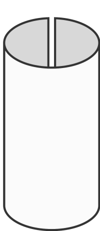

# Other kind of game boards

 In the previous example we had a hard cut on the edge of our game board. What if we change this by using a sphere for a game board? I think this sounds like fun ... :)

 So what do we actually have to change to make our game board act like a sphere? Think about it for a moment...

 May be this diagramm clears things up.



Think of our current game board like a piece of paper with hard edges. We cannot move over our edge on each side. But what if we fold our game board like a paper roll?

In this case moving out of the left edge would mean that we move in on the right edge. And if we do the same for the top and bottom edge, than we are done with our game board acting like a sphere.

For that we have to change our active neighbour function. Instead of having a hard boundary limitation we must "look beyond the horizon". 

So if we access an item with negative coordinates (CUI is on `0, 0` for example), we must access the item on the right side. Accessing a Python List actually already works like this. 

```python
l = list(range(10))

# using index based access we can access the last item by using negative indices
print(l[0], l[-1])
```

```python
def alive_neighbours(board, cell_coordinate: tuple) -> int:
    """
    Returns the number of alive neighbours on a spherical game board 
    """
    # unpack the tuple
    x, y = cell_coordinate

    # We do not want to have 'from_values' below 0, therefore we use max
    # We do not want to have 'to_values' above our defined width/height, 
    # therefore we use min
    # Pay attention: 
    # last valid width idx is width -1, last valid height idx is height -1
    x_from, x_to = max(x-1, 0), min(x+1, width -1)
    y_from, y_to = max(y-1, 0), min(y+1, height -1)

    # use of comprehension and sum
    alive_cells = sum(board[y][x] 
        for y in range(y_from, y_to +1)
        for x in range(x_from, x_to +1))

    # reduce by cell state of CUI
    return alive_cells - board[y][x] 

```

[Overview](./overview.md) | [Previous chapter (Game of Life)](./gol.md) 