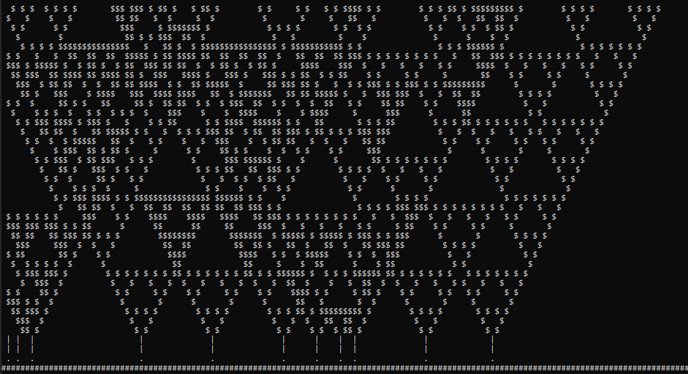
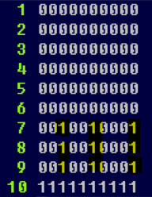

[Overview](./overview.md) | [Back (Cellular automatons)](./cellular_automation.md) | [ Next (Game Of Life)](./gol.md)

# Creating a forest

In the last chapter we used `rule 90` to create the Sierpinski triangle. We now want to use the same logic to create some trees/plants growing from the bottom to the top.

The final result should look similar to this:


The bottom line with the `#` symbols represents our foundation. On top of that we have some seeds (`.`) which are randomly distributed. Out of these seeds grow little stalks and out of that emerge our beautiful trees by applying our well known `rule 90`.

Out of the fact that our plants grow step by step from bottom to top we cannot use a 1-dimensional game board. In the example before it was possible to print the content of the board and forget about it. We created a new 1-dimensional "row" dependening on the previous row and it was overwritten.
 We could do that before, because a 1-dimensional board is actually just a row and **we printed from top to bottom**. 

For our forest we need a 2-dimensional board, drawn completely with every step and filled with content, step by step, from bottom to top. Because of the fact that we draw the complete board in every step and fill it from below it seems that our plants/trees are growing.

## 2-dimensional game board

We used a list of `1s` and `0s` for our 1-dimensional game board before. Let's call this a row. We can create a 2-dimensional board by defining a list of these rows. 

```python
# create a board with fixed width and height
width = 150
height = 40

# the width defines the length of our row
# we need this row `height` times. So let's create a loop
board = []
for _ in range(height):
    # create a list with width times `0`
    row = ['0' for _ in range(width)]

    # add this to our board
    board.append(row)

# our board now consists of 40 rows with length 150

```

We could also use a nested *list comprehension*  for this, that is an alternative solution for creating the board:
```python
width = 150
height = 40
board = [['0' for _ in range(width)] for _ in range(height)]
```

*Note: We could use numpy for a 2-dimensional board/2-dimensional array. But I intentionally used only Python builtins. Using frameworks like numpy or pandas kind of feels like learning a new programming language and this is not the intention of this course.*

## Initializing the foundation, seeds and stalks

The last line of our board should be a solid foundation. On top of that we distribute seeds randomly.
We could to this with the following Python code:
```python
# define width and height for our game board
width = 150
height = 40

# create the actual board
board = [['0' for _ in range(width)] for _ in range(height)]

# add the foundation on the last row of our 2d-board
# -1 is the index for the last row
board[-1] = ['1' for _ in range(width)]

# add seeds with a percentage of 10 percent
board[-2] = ['1' if random.random() < 0.1 else '0' for _ in range(width)]

# add 2 lines with ones on the position 
# of seeds. These are for our stalks
board[-4] = board[-3] = board[-2]
```

In the last line we use the same row for the third last and for the forth last line, which is the same as our second last line. 

This is just a shortcut for writing:
```python
board[-3] = board[-2]
board[-4] = board[-3]
```

Remember that our data logic currently only contains `0s` and `1s`. So our actuall board looks internally something like this (I used a smaller width and height for better visualisation).



The second last line (`line 9`) will become our seeds later on, `line 8` and `line 7` represent the stalks. For this the lines must contain the same `raw payload` as `line 9`.

For the display of our forest we must now use different symbols, depending on the actual line number.

## Using different symbols
In our previous example we used the same kind of symbols for every row (`#` symbols). We now want to change this for our forest. The foundation should be representated by `#`, the stalks be representated by `|` and the actual plant by a `$` symbol. 

**We do not want to change our logic in any way**. We want to *reuse* the `rule_90` and also the function `current_population`. Therefore we keep the logic as it is (with `0s` and `1s`). 

We can only change the representation depending on the row beeing drawn. For that we define a dictionary, which maps the line number to an output symbol.

```python
import collections
width = 150
height = 40

symbols = collections.defaultdict(lambda: '$')
symbols[height-1] = "#"
symbols[height-2] = "."
symbols[height-3] = "|"
symbols[height-4] = "|"
```

We use a default dict for this. The defaultdict delivers in our case a `"$"` if we have no valid key. So for the last line we return a `"#"` for the foundation, for the second last line we return a `"."` for the seeds, and for the third and forth last line we return `"|"`. 

For every other key request we get back a `"$"`, specified in the creation of the default dict.
```python
import collections
width = 150
height = 40

symbols = collections.defaultdict(lambda: '$')
symbols[height-1] = "#"
symbols[height-2] = "."
symbols[height-3] = "|"
symbols[height-4] = "|"

# every lookup will return a value
symbols[39] # will return a '#'
symbols[37] # will return a '|'
symbols[10] # will return a '$'
symbols[0]  # will return '$'
symbols[2310]  # will also return '$'

```

# New output function

With this we have every ingredient to create our new output function. 

```python
import os

def print_board(board):
    """
    Prints the game board. Must be a list of lists.
    To print the screen must be cleared before. We can do this with a system 'cls' command
    """ 
    # clear the screen
    os.system('cls')

    # print our board
    for line_number, row in enumerate(board):
        output_line = "".join(row)
        output_line = output_line.replace("1", symbols[line_number])
        output_line = output_line.replace("0", " ")
        print(output_line)
```

If we would just print the board, one after another we would have a complete board printed below each other. This is not what we want. We want to population at `t_1` to be shown **instead** of the population at `t_0`. 
For this we need a way to clear our output screen, which is in the case just the terminal. If you are using a Windows OS we can use the command `cls` for that. If you are using Linux or MacOS with a bash shell, you can use the `clear` command. 

Fortunatly it is very easy with Python to just execute a command. The call of `os.system('cls')` will just clear our terminal window in the beginning of the `print_board` routine.

One important aspect happens in line `output_line = output_line.replace("1", symbols[line_number])`. Here we have the lookup of the symbols for printing depending on the current line number. Make sure, that you understand, what is happening here.

*Hint: It is just like before a normal dictionary lookup. We have stored the symbols to print depending on the line number and pass the line number als a key to our dictionary. We now need to replace every occurence of a `1` with this symbol*

# Putting it all together

Let's put every part together. 

```python

# We need to know at which line our rule_90 is applied.
# Can you figure out where we the rule starts and
# where the static data ends?
# Here are some hints:
# first line has index 0
# last line (foundation) has index 39
# seed line has index 38
# stalks are on ...
# the last seed line needs to be our current starting point
current = ...

while True:
    print_board(board)

    # we can reuse the new_population function
    # but we cannot pass the complete board.
    # What do we need to pass instead?
    # We need to pass just a single row
    # The current row in indicated by variable `current`
    new_pop = new_population(...)

    # We decrement the line number
    # because we go from bottom to top
    current -= 1

    # and update the line in our board
    # the updated board will be printed in the next iteration
    board[current] = new_pop

    # let's sleep a little bit. 
    # Adjust if desired
    time.sleep(1.0)

    # What do we do if our plants have reached the end of our "scene"?
    # We just quit by breaking or while loop
    if current == 0:
        break
```

[Overview](./overview.md) | [Back (Cellular automatons)](./cellular_automation.md) | [ Next (Game Of Life)](./gol.md)