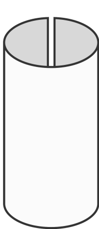

[Overview](./overview.md) | [Back (Game of Life)](./gol.md) 

# Other kind of game boards

 In the previous example we had a hard cut on the edge of our game board. What if we change this by using a sphere for a game board? I think this sounds like fun ... :)

 So what do we actually have to change to make our game board act like a sphere? Think about it for a moment...

 May be this diagramm clears things up.



Think of our current game board like a piece of paper with hard edges. We cannot move over our edge on each side. But what if we fold our game board like a paper roll?

In this case moving out of the left edge would mean that we move in on the right edge. And if we do the same for the top and bottom edge, than we are done with our game board acting like a sphere.

For that we have to change our `alive_neighbours` function. Instead of having a hard boundary we must "look beyond the horizon". 

Let us assume that our CUI has coordinates `0, 0`. For simplicity we only focus on 1 axis, in this case the `x` axis. For the calculation of alive neighbours we must check the neighbours from `x-1` to `x+1`. `x-1` will result in `-1` for the CUI with coordinates `0, 0`.

The cool thing about lists is, that we can acutally access items with negative indices. 

```python
l = list(range(10))

# using index based access we can access the last item by using negative indices
print(l[0], l[-1])
```
So this case will already work. 

The problem is when we try to access items outside the valide range of the list.
```python
l = list(range(10))

# will raise in IndexError. Valid indices are from 0 to 9
print(l[10])    # IndexError!
```

What we like to do is accessing item with index 0 if we access an item out of bound. If this is not clear think about the paper roll.

But how can we implement this in a simple way? We could use the `%` operator. 
```python
width = 3
l = list(range(width))

index = 0
print(l[index % width])    # Access idx 0

index = 1
print(l[index % width])    # Access idx 1

index = 2
print(l[index % width])    # Access idx 2

index = 3                  # This index is invalid!
print(l[index % width])    # Modulo avoids an IndexError. Access idx 0
```

If we access items "on the other side of the list", we cannot use a simple for loop anymore. Using a for loop from `-1` to `2` (end range is exclusive) would still work, but on the other side this would lead to errors. Assuming a board width of 10 looping from `8` to `1` (`10 % 10 +1`) is not possible.

For that reason we have to access the items individually.

So let's take these new findings into account in the new implementation of `alive_neighbours`. 

```python
def alive_neighbours(board, cell_coordinate: tuple) -> int:
    """
    Returns the number of alive neighbours on a spherical game board 
    """
    # unpack the tuple
    x, y = cell_coordinate

    x_from, x_to = x-1, (x+1) % width
    y_from, y_to = y-1, (y+1) % height

    # Access the items individually and sum them up 
    # (sum needs an iterable, so we create a temporary list, without the CUI)
    alive_cells = sum([
        board[y_from][x_from], board[y_from][x],board[y_from][x_to],
        board[y][x_from],                       board[y][x_to],
        board[y_to][x_from],   board[y_to][x],  board[y_to][x_to],
    ])

    return alive_cells 

```

That is the only function we have to change for a spherical game board. That is kind of neat :)

[Overview](./overview.md) | [Back (Game of Life)](./gol.md) 